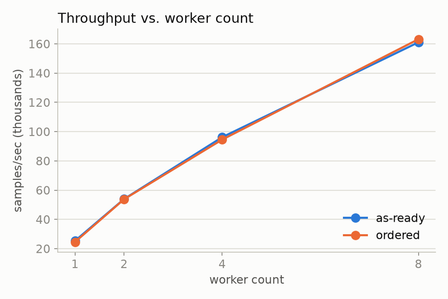
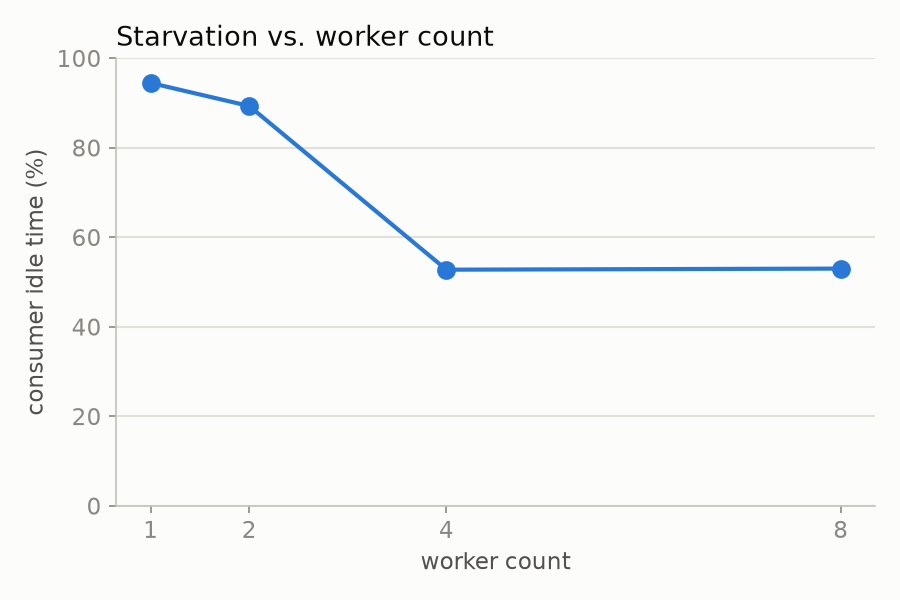
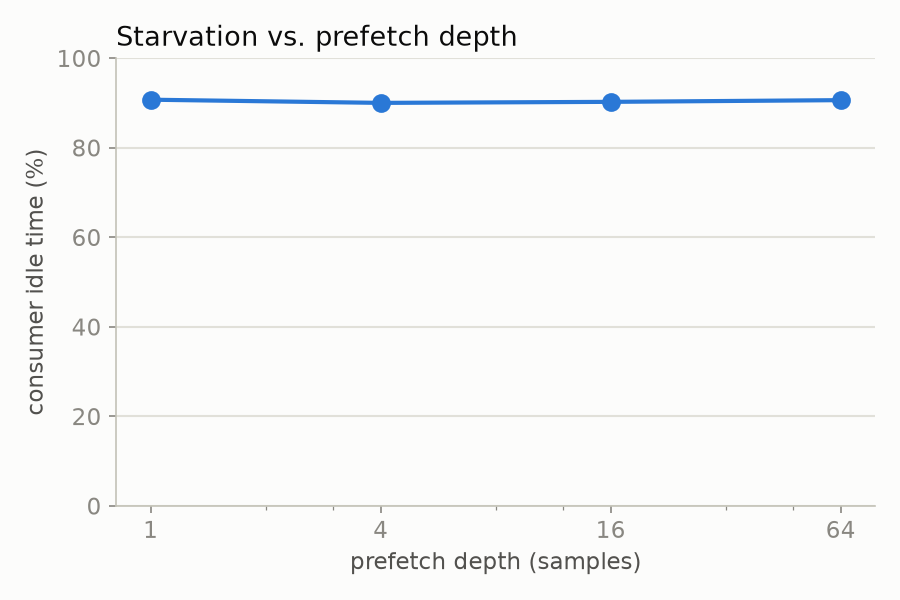
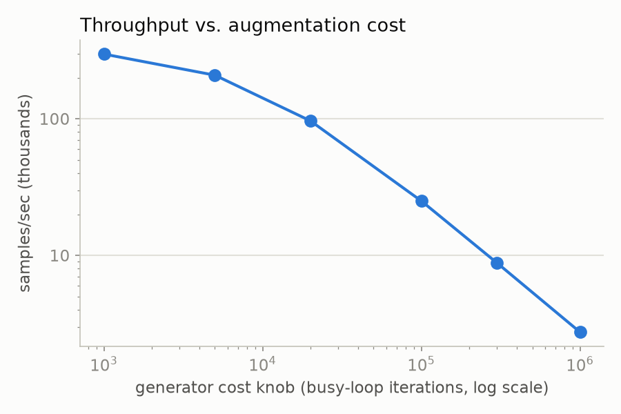
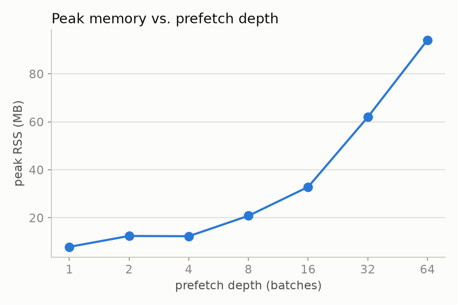
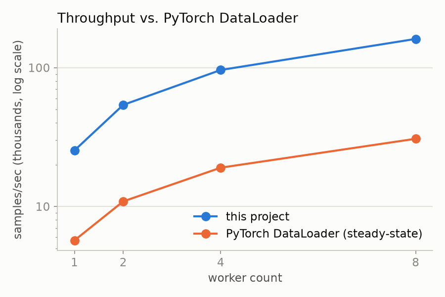

# High-Throughput Synthetic-Data Dataloader

[](https://github.com/czhao-dev/ai-ml-design-patterns/actions/workflows/test-high-throughput-dataloader.yml)

A from-scratch, multi-worker data pipeline in C++20 that generates synthetic
training data and feeds a consumer (a real or simulated training step) at
full throughput — with deterministic, resumable, shardable iteration.

Training throughput is frequently bound not by the accelerator but by
**data supply**: the loader can't produce, decode, and augment samples fast
enough to keep the compute busy. This project builds the data-supply
system — a bounded prefetch queue, a worker pool, deterministic sharding
and shuffling, and a resumable iterator — and proves it with tests and
benchmarks rather than assertions.

The pipeline generates its own data (procedural images, Markov token
sequences, known-function regression), so there is no external dataset and
no dataset-license exposure.

## Architecture

```
index stream -> [shuffle] -> [shard] -> WORKER POOL -> prefetch queue -> [collate] -> consumer
                                          |  generate                       (batch)      (train step)
                                          |  transform (augment/decode)
                                          +- (N parallel workers)
```

- **`IndexStream`** — a shared, thread-safe dispenser over a precomputed,
  per-epoch index sequence; supports resuming from an arbitrary position.
- **`epoch_permutation`** — a seeded, precomputed full-epoch Fisher-Yates
  shuffle. Precomputed (not streamed through a windowed buffer) so the
  entire epoch order is a pure function of `(seed, epoch, num_samples)` —
  a checkpoint never needs to serialize shuffle-buffer state.
- **`shard_indices`** — splits a shuffled epoch sequence across ranks by
  interleaved position, matching the PyTorch `DistributedSampler`
  convention: every index belongs to exactly one rank, ranks differ in size
  by at most one element.
- **Generators** (`ImageGenerator`, `TokenGenerator`, `TabularGenerator`) —
  deterministic in `(index, seed)`, each with a busy-loop cost knob to
  simulate expensive decode/augment.
- **`Transform` / `TransformPipeline`** — composable, stateless
  augmentation stages.
- **`BoundedQueue<T>`** — a mutex/condvar bounded MPMC queue providing
  backpressure between producers and the consumer, with graceful
  close/drain semantics.
- **`WorkerPool`** — N producer threads pulling from a shared `IndexStream`,
  in **as-ready** (fastest, delivery order not guaranteed) or **ordered**
  mode (a bounded `ReorderBuffer` restores strict epoch order, keyed by
  dispensing *position* rather than the — possibly shuffled — sample index).
- **`collate`** — assembles same-shaped `Sample`s into a contiguous `Batch`.
- **`Checkpoint`** — `(epoch, consumer_position)`. Resuming discards
  whatever was generated-but-unconsumed past that point and restarts
  production exactly there; because generation is a pure function of index,
  nothing is lost.

## Building

Requires CMake ≥ 3.21 and a C++20 compiler.

```sh
cmake --preset debug      # or: release, asan, ubsan, tsan, coverage
cmake --build --preset debug
ctest --preset debug --output-on-failure
```

All four presets (debug/asan/ubsan/tsan) are exercised on every push via
GitHub Actions (`.github/workflows/test-high-throughput-dataloader.yml`).

## Status

| Phase | Scope | Status |
|---|---|---|
| P0 | Single-worker pipeline, bounded queue, mock consumer, samples/sec | ✅ |
| P1 | N-worker pool, backpressure, batching, as-ready/ordered modes | ✅ |
| P2 | Deterministic shuffle, sharding, resumable checkpoint/restore | ✅ |
| P3 | Prefetch-depth tuning, starvation/cost/memory benchmarks | ✅ |
| Baseline + report | PyTorch `DataLoader` head-to-head, this README | ✅ |
| Stretch | pybind11 binding, shard file format, NUMA placement | not started |

53 unit tests across 17 test suites, all green under `debug`, `ASan`,
`UBSan`, and `TSan`.

## Correctness

The determinism, sharding, and resumability contracts are the point of this
project — not an afterthought — so each is a direct test, not an inference
from throughput numbers:

- **Determinism**: `epoch_permutation(seed, epoch, n)` is verified to be a
  bijection over `[0, n)`, deterministic for a fixed `(seed, epoch)`, and to
  change under a different seed or epoch.
- **Worker-count invariance**: in **ordered** mode, running the same
  `(seed, epoch)` epoch through 1, 2, 4, and 8 workers produces byte-for-byte
  identical output — a direct race detector for the reorder buffer. (In
  **as-ready** mode, only the *set* of `(index, Sample)` pairs is
  guaranteed identical across worker counts — delivery order is explicitly
  not, by design.)
- **Shard disjointness & coverage**: for a range of `(num_samples,
  world_size)` including non-evenly-divisible cases, every rank's shard is
  checked pairwise-disjoint and their union checked equal to the full epoch.
- **Resumability under in-flight loss**: the sharpest test in the suite —
  a pipeline is run, the consumer reads only the first *K* samples, and
  everything the (still-running) producers generate beyond *K* is drained
  and discarded, simulating a crash. A **fresh** pipeline resuming at
  `consumer_position = K` is then checked to reproduce exactly the missing
  suffix, so `pre ++ post == uninterrupted`.
- All of the above run clean under ThreadSanitizer, including the
  concurrency-heavy `BoundedQueue` and `ReorderBuffer` stress tests (tens of
  thousands of items, multiple producers and consumers).

## Benchmarks

Machine: 8 logical CPUs (sandboxed/shared environment — see notes below on
where that shows up). Numbers are from `release`-preset (optimized)
binaries; relative trends are the point, not absolute throughput on any
particular reader's hardware.

### Throughput vs. worker count



Near-linear scaling across the full sweep (25.4k → 53.9k → 96.2k → 161.1k
samples/sec at 1/2/4/8 workers) — no saturation knee yet at 8 workers on
this machine. Ordered mode tracks as-ready almost exactly: the reorder
buffer's overhead is small once its capacity comfortably exceeds the number
of in-flight workers.

### Starvation vs. worker count



With a deliberately expensive generator (20,000 busy-loop iterations/sample)
and an infinitely-eager consumer, a single worker leaves the consumer idle
94.5% of the time, falling to 52.8% at 4 workers and plateauing at 53.0% at
8 — the knee is at 4 workers on this machine, past which more parallelism
stops buying additional relief for this particular workload/capacity
combination. Identifying that knee (rather than assuming scaling from a
formula) is exactly what this benchmark harness is for.



**Starvation vs. prefetch depth**, at a fixed (still-marginal) worker count,
measures flat at ~90% idle across depths 1–64 — an honest negative result
worth stating (and plotting) rather than hiding: this generator's cost is
a deterministic busy-loop, so it has very little *timing variance* for a
bigger buffer to smooth over. Buffering helps absorb bursty per-sample
latency; it cannot fix a sustained supply/demand mismatch — only more
workers (or cheaper generation) can. See `bench/p3_starvation_bench.cpp`
for the fuller discussion in comments.

### Throughput vs. augmentation cost



A clean, continuous falloff on a log-log scale as the busy-loop cost knob
increases — 297k samples/sec at 1,000 iterations down to 2.7k at
1,000,000, with no flat "queue-bound" plateau at the cheap end: with
optimizations on, fixed per-sample overhead (rasterization, queue/sync) is
low enough that even a modest cost knob is immediately visible in
throughput. The pipeline is compute-bound across essentially this entire
range on this hardware (an unoptimized debug build shows a genuine flat
plateau below ~20,000 iterations before the same falloff, since its much
higher fixed overhead dwarfs a small cost knob) — a useful thing to know
when choosing a realistic cost knob for further experiments.

### Peak memory vs. prefetch depth



Measured with a standalone tool (`sdl_memory_probe`) that runs one
configuration to completion and reads `getrusage` peak RSS — deliberately
one OS process per data point, since peak RSS is a process-lifetime
high-water mark that a shared benchmark process would contaminate across
configurations. A small consumer delay (100us/sample) is used to force the
queue to genuinely fill toward its capacity — without it, an optimized
build's workers are fast enough that the queue rarely holds more than a
handful of samples regardless of nominal capacity, and the memory curve
would flatten out for the wrong reason. With that backlog forced, peak RSS
scales from 7.9 MB at depth 1 to 94.1 MB at depth 64
(`capacity = prefetch_depth × batch_size` samples buffered, each a
64×64×3 float image) — the throughput/memory tradeoff the prefetch-depth
knob is trading against.

### vs. PyTorch `DataLoader`



`bench/baseline_pytorch.py` runs an equivalent synthetic task (a `3×64×64`
tensor per sample, with a wall-clock-calibrated busy-wait standing in for
augmentation cost — not the same rasterization algorithm as the C++
generator, since a fair infrastructure comparison shouldn't hinge on which
language executes nested pixel loops faster). Two numbers are reported per
worker count:

- **first-epoch** throughput, which includes PyTorch's per-worker
  **process** startup cost — on macOS, the default `spawn` start method
  re-imports the whole module in every worker process, and this cost is
  large enough that first-epoch throughput actually *drops* as workers
  increase (measured: 5.6k → 2.2k → 2.6k → 2.1k → 1.6k samples/sec at
  0/1/2/4/8 workers) — a single benchmark run never gets to see workers
  give *any* benefit;
- **steady-state** throughput (a later epoch, `persistent_workers=True`),
  which scales properly once that one-time cost is amortized (5.6k → 5.7k →
  10.9k → 19.0k → 30.7k samples/sec).

The plot compares this project's numbers (log scale — the gap is large
enough that a linear axis would flatten PyTorch's line unreadably) against
PyTorch's **steady-state** numbers, the fairer of its two. This project
leads at every worker count measured, by roughly 4–5x (25.4k vs. 5.7k at 1
worker; 161.1k vs. 30.7k at 8). The gap is explained, not just observed: it
traces to the process-vs-thread worker model plus language overhead —
`std::thread` workers have no per-epoch startup cost and no per-batch
IPC/serialization tax, and a compiled per-pixel loop has no Python
interpreter overhead standing between it and the CPU. PyTorch's `DataLoader`
is a mature, general-purpose tool solving a much broader problem
(arbitrary Python transform pipelines, GPU staging, `collate_fn`
customization); this project trades that generality for throughput on
exactly the synthetic-data-supply problem it was built to solve.

### Reproducing these numbers

```sh
cmake --preset release && cmake --build --preset release
./build/release/bench/sdl_bench --benchmark_filter=BM_P1WorkerPool
./build/release/bench/sdl_bench --benchmark_filter=BM_P3Starvation
./build/release/bench/sdl_bench --benchmark_filter=BM_P3CostSweep
for depth in 1 2 4 8 16 32 64; do
  ./build/release/bench/sdl_memory_probe 4000 4 "$depth" 32 5000 100
done

python3 -m venv .venv-bench && source .venv-bench/bin/activate
pip install -r bench/requirements.txt
python3 bench/baseline_pytorch.py

# regenerate docs/plots/*.png from (hardcoded) measured values:
pip install matplotlib
python3 bench/plot_results.py
```

## Repository layout

```
include/sdl/            public headers (Sample, Batch, Generator, ...)
src/
  generators/           image / token / tabular synthetic sources
  transform/            composable augment/decode stages
  queue/                bounded prefetch queue + backpressure
  pipeline/             worker pool, index stream, shuffle, shard
  collate/              batching
tests/                  GoogleTest: unit + determinism + concurrency invariants
bench/                  Google Benchmark harness, memory probe, PyTorch baseline
```

## License

MIT — see [LICENSE](LICENSE). Dependencies (GoogleTest, Google Benchmark)
are BSD/Apache-2.0. All data is synthetic and generated in-process: no
external dataset, no dataset license or redistribution obligation.
